<picture>
  <source media="(prefers-color-scheme: dark)" srcset="./dark.svg">
  <source media="(prefers-color-scheme: light)" srcset="./light.svg">
  
</picture>

<h3 align="center">Building GenAI &amp; Agentic AI Systems · Policy Making for a Practical India</h3>

<i>My context window keeps growing.</i>

---

### 🙏 Namaskar, I'm Spandan

While most of my batch was presenting AI-generated case studies to professors, I was presenting AI-driven policy solutions to a Union Minister.

I started learning through AI itself, asking questions until things clicked, and I still love to explore whatever comes next. That curiosity became:

- a **deep learning model** that detects peptic ulcers from endoscopy images to help doctors catch what's easy to miss,
- an **enterprise RAG system** built so students like me can understand RAG without the struggle I went through,
- and an **education policy pitch** that took me to the Lok Sabha as Odisha's only delegate.

Every one of them taught me the same simple thing: **a system nobody can explain is a system nobody approves.**

> Practicality, trust, and responsibility with a Gen Z mindset. That's what I've learned, and that's what I preach.

---

### 🎯 Focus

**Generative AI** · **Agentic AI** · **RAG** · **LLM applications** · **AI guardrails & evaluation** · **Deep learning for healthcare**

🔭 **Currently exploring:** Deep Agents · vectorless RAG · context engineering · Dev AI

---

### 🛠️ Featured Projects

#### [Enterprise Agentic RAG Pipeline](https://github.com/nandacode2003/Enterprise-Rag)

Built so students like me can see RAG work end to end instead of fighting it alone. It is a **planner → retriever → responder** agent that:

- remembers each conversation,
- reranks results to cut through noisy documents,
- blocks jailbreaks and prompt injections before retrieval,
- falls back from OpenAI to Anthropic when a call fails,
- and cites every source it uses.

`LangGraph` `FastAPI` `Qdrant` `Jina AI` `NeMo Guardrails` `RAGAS` `Redis` `Prometheus` `Streamlit`

#### [Peptic Ulcer Detection from Endoscopic Images](https://github.com/nandacode2003/Peptic_Ulcer_Detection)

A deep learning assistant for doctors that flags peptic ulcers in endoscopy images. An ensemble of three CNNs reaches **98.0% accuracy** and **99.0% recall**, tuned so it rarely misses a real ulcer.

`Python` `TensorFlow` `scikit-learn`

---

### 🇮🇳 Beyond the Code

| Role | Where | When |
|---|---|---|
| **Odisha Representative**: one of 36 delegates picked nationally, and the only one from Odisha | Know Your Leaders Conclave, Lok Sabha | 2026 |
| **National Delegate**: pitched an education reform proposal (*Ek Bharat Shreshtha Shiksha*) to the Union Education Minister and a rural employment proposal (*VB-GRAM-G*) | Viksit Bharat Young Leaders Dialogue, Bharat Mandapam | 2025–26 |
| **Youth MLA, 2nd term**: broke down the Yuva Shakti Union Budget and what it means for young people | Viksit Bharat Youth Parliament, Odisha | 2025–26 |
| **Youth Icon**: Youth in Policy Making and Nasha Mukt Bharat | Khordha District, nominated by the Ministry of Youth Affairs &amp; Sports | |

---

### 🧰 Engineering Stack

| | |
|---|---|
| **Languages** | Python · SQL · C |
| **GenAI / Agents** | LangGraph · LangChain · Hugging Face · RAGAS · NeMo Guardrails |
| **ML / DL** | TensorFlow · PyTorch · scikit-learn · NumPy · Pandas |
| **Vector &amp; Data Stores** | Qdrant · FAISS · Redis · MongoDB · SQL |
| **Backend &amp; Ops** | FastAPI · Docker · Prometheus · Git · GitHub |
| **Visualization** | Matplotlib · Seaborn · Streamlit |

---

### 🎓 Education

- **B.Tech, Computer Science &amp; Engineering**, C.V. Raman Global University, Bhubaneswar · 2027 · CGPA 8.4
- **Class XII (CBSE)**, D.A.V. Public School, CDA-6, Cuttack · 93.4%

---

### 📊 GitHub Activity

  <picture>
    <source media="(prefers-color-scheme: dark)" srcset="https://github-readme-stats.vercel.app/api?username=nandacode2003&show_icons=true&hide_border=false&bg_color=1C2550&title_color=F0704A&text_color=F6EAD3&icon_color=E9B44C&border_color=E9B44C&ring_color=F0704A">
    
  </picture>
  <picture>
    <source media="(prefers-color-scheme: dark)" srcset="https://github-readme-stats.vercel.app/api/top-langs/?username=nandacode2003&layout=compact&hide_border=false&bg_color=1C2550&title_color=F0704A&text_color=F6EAD3&border_color=E9B44C">
    
  </picture>

---

### 🤝 Connect

  <a href="https://www.linkedin.com/in/spandannanda">LinkedIn</a> ·
  <a href="mailto:spandannanda3@gmail.com">spandannanda3@gmail.com</a> ·
  <a href="https://github.com/nandacode2003">GitHub</a>

Banner: Odisha Pattachitra × engineering blueprint, with an ASCII portrait drawn over the Konark wheel. Pure SVG + SMIL, no JavaScript.
